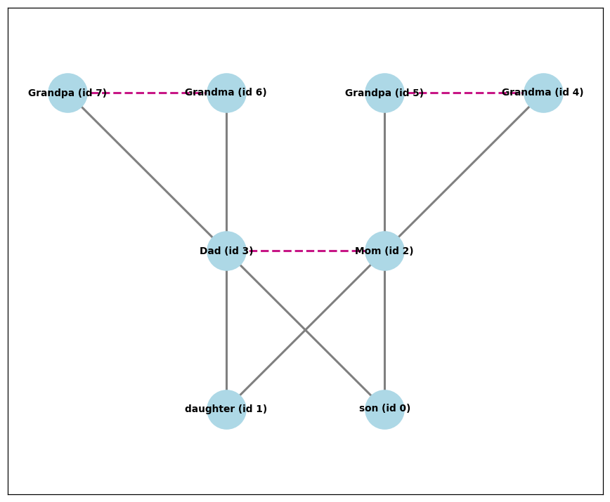
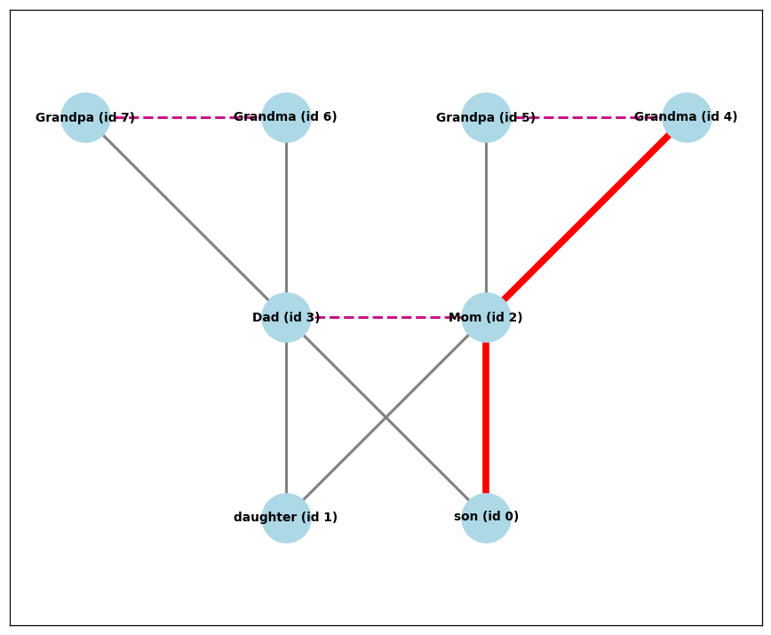

# Family Tree Builder

**[Live demo](https://family-tree-builder-abdullah-ismail.streamlit.app/)** · [Proofs](proofs.pdf) · [Notebook](project_bfs_logic.ipynb)

Build a family tree in your browser, then ask how any two people are related.

---

## Overview

Most family tree tools record who is related to whom. This one answers questions
about those relationships.

Say you know your grandmother and you know your cousin, but you have no idea how
the two connect. This app traces the chain: Grandma, then Mom, then you, then
your cousin. It does that by treating the family as a network rather than a list,
then searching that network for the shortest chain between two people.

The search and the layout are written from scratch rather than taken from a
library, because the goal was to understand and prove the algorithms rather than
call them.

---

## Goals

1. Implement graph search, path reconstruction, and generation assignment
   directly, without a library's built-in versions.
2. Write formal proofs that each routine returns the right answer and always
   finishes.
3. Enforce the rules a family tree has to obey, so it can never reach an
   impossible state.
4. Make it usable by someone with no technical background and no instructions
   from me.

---

## Method

### Modeling the family as a network

Each person is a point. Two kinds of connection join them: parent to child, and
marriage. Every person's record stores their parents, their children, and their
spouse.

### Placing people on the right row

A person with no parents sits at the top. Anyone else sits one row below their
deepest parent, worked out by following parent links upward until the top is
reached. Someone with no parents of their own who married into the family is
placed on their spouse's row so couples line up.

Grey lines connect parents to children. Dashed pink lines connect married
couples. Two people can share a name, so each person carries an id number.



### Finding how two people are related

The app runs a breadth first search from one person, exploring outward one step
at a time: first everyone directly connected, then everyone connected to those
people, and so on. Because it expands evenly in all directions, the first time it
reaches the target it has found the shortest chain. While searching it records
which person it arrived from, and walking those records backwards rebuilds the
full path.

Asking how Grandma (id 4) relates to son (id 0) returns Grandma, then Mom, then
son. Two steps apart, drawn in red over the tree.



### Keeping the data valid

Every relationship is checked before it is saved. Nobody can be their own parent,
nobody gets a third parent, and nobody can marry their own ancestor.

The important check runs a second search, this time following parent links only
and only upward. If the proposed parent's ancestry already contains the child,
the new link would close a loop in which someone is their own ancestor. That loop
would make the generation calculation run forever and crash the page, so it is
blocked with a plain English explanation instead.

### Proving it works

Three routines have written correctness proofs in `proofs.pdf`, using loop
invariants and induction. Writing them forced two requirements into the open that
the code had been relying on silently: parent links must never form a loop, and
each person can have at most one spouse. Both are now enforced by the app.

---

## Results

The app is deployed and works end to end. Relationship searches return the
shortest chain between any two connected people, the tree redraws itself as
people are added, and the validation rules hold.

Demoed to five people, all of whom found it worked well as a demo.

### Limitations

- **Nothing is saved.** A tree exists only while the browser tab is open.
  Refreshing clears it.
- **Relationships cannot be edited.** Fixing a wrong connection means removing
  the person and adding them again.
- **Validation is not exhaustive.** Family structures get complicated, and the
  rules catch the cases that would break the tree rather than every case that
  looks unusual.

---

## Next steps

**Saving.** Writing trees to a file or database is the most requested change and
the clearest gap.

**Editing relationships.** Changing a link means removing it from both people's
records and re-running every validation check, which is why it was left out.

**Remarriage.** Two of the five people who tried the demo surfaced a second
marriage. Each person is currently limited to one spouse, which is what
guarantees the generation calculation always terminates, so supporting
remarriage means reworking that routine to track which people it has already
visited.

**Larger trees.** The layout holds up to roughly a dozen people per generation.
Past that, labels crowd and a different layout approach would be needed.

**Lowest common ancestor and relatedness.** The parent tracking already in place
would support finding two people's most recent shared ancestor, and from there
how genetically related they are.

---

## Individual contributions

Solo project. The data model, algorithms, proofs, validation, user testing,
interface, and deployment are all my own.

**Abdullah Ismail**, Computer Science & Mathematics, Northeastern University
[GitHub](https://github.com/25abdullah) · [LinkedIn](https://linkedin.com/in/abdullah-ismail-09a964368)

---

## Repository

```
README.md                  this file
app.py                     the Streamlit app
project_bfs_logic.ipynb    rough working notebook, kept as a record of how
                           the search and layout were built up. Not cleaned,
                           and not the version the app runs.
proofs.pdf                 formal correctness proofs
requirements.txt           dependencies
images/                    figures used above
```

```bash
pip install -r requirements.txt
streamlit run app.py
```

**Tools:** Python, NetworkX, Matplotlib, Streamlit
